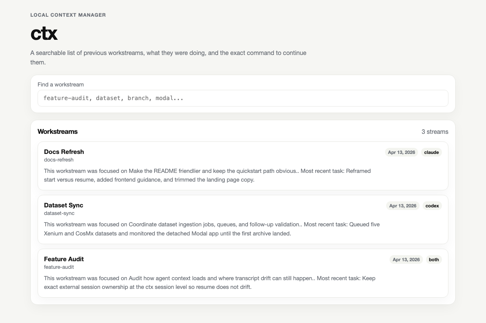

# ctx

Local context manager for Claude Code and Codex.

Keep exact conversation bindings, resume work cleanly, branch context without mixing streams, and inspect everything from a local browser frontend.

```text
Claude Code chat          Codex chat
      |                      |
      v                      v
   /ctx ...               ctx ...
          \              /
           v            v
      +----------------------+
      | workstream: feature-audit |
      |   claude:  abc123    |
      |   codex:   def456    |
      +----------------------+
                 |
                 +--> feature-audit-v2 branch
```

## Why `ctx`

- Exact transcript binding: each internal ctx session can bind to the exact Claude and/or Codex conversation it came from.
- No transcript drift: later pulls stay on that bound conversation instead of jumping to the newest chat on disk.
- Safe branching: start a new workstream from the current state of another one without sharing future transcript pulls or hijacking the source conversation.
- Indexed retrieval: saved workstreams, sessions, and entries are indexed for fast `ctx search` lookup.
- Local-first: no API keys, no hosted service, plain SQLite plus local files.

## 4-Step Demo

1. Clone and set it up:

```bash
git clone https://github.com/dchu917/ctx.git
cd ctx
./setup.sh
```

2. Open the browser frontend:

```bash
ctx web --open
```



Run `ctx web --open` in the terminal or in the agent shell.

3. Start a new workstream:

Claude Code:

```text
/ctx start feature-audit --pull
```

Codex or your terminal:

```bash
ctx start feature-audit --pull
```

From the browser UI, you can:

- browse saved workstreams
- search indexed context
- click into a workstream detail page
- copy the exact Claude or Codex command to continue it

4. Come back later and continue or branch:

Claude Code:

```text
/ctx resume feature-audit
/ctx branch feature-audit feature-audit-v2
```

Codex:

```bash
ctx resume feature-audit
ctx branch feature-audit feature-audit-v2
```

## Quick Start

Recommended path if you already cloned the repo:

```bash
./setup.sh
```

That does the local setup:

- creates `./.contextfun/context.db`
- writes `./ctx.env`
- installs `ctx`, `ctx-list`, `ctx-search`, `ctx-start`, `ctx-resume`, `ctx-delete`, `ctx-branch`, and `ctx-web` into `~/.contextfun/bin`
- links local skills into `~/.claude/skills` and `~/.codex/skills`

Then restart your client.

## Experimental: OpenCode And Cursor

`ctx` now includes project-local experimental command scaffolding for both OpenCode and Cursor.

OpenCode:

- command files live in `.opencode/commands/`
- includes `/ctx`, `/ctx-list`, `/ctx-search`, `/ctx-start`, `/ctx-resume`, `/ctx-rename`, `/ctx-delete`, `/ctx-branch`, and `/ctx-web`
- OpenCode also documents support for project command files, `AGENTS.md`, and Claude-compatible skill locations

Cursor:

- command files live in `.cursor/commands/`
- includes `/ctx`, `/ctx-list`, `/ctx-search`, `/ctx-start`, `/ctx-resume`, `/ctx-rename`, `/ctx-delete`, `/ctx-branch`, and `/ctx-web`
- Cursor also supports project custom slash commands and project instructions such as `AGENTS.md`

Important:

- treat both integrations as experimental for now
- the repo includes the command files and instruction scaffolding, but they have not been validated as thoroughly as the Claude Code and Codex flows
- if a command does not behave the way you expect in Cursor or OpenCode, fall back to the same plain command in the agent shell:
  - `ctx`
  - `ctx list`
  - `ctx search ...`
  - `ctx start ...`
  - `ctx resume ...`
  - `ctx rename ...`
  - `ctx delete ...`
  - `ctx branch ...`
  - `ctx web --open`

## Browser Frontend

Open the local browser UI from the terminal or the agent shell:

```bash
ctx web --open
```

Or, if you want an explicit alias:

```bash
ctx-web --open
```

What the frontend gives you:

- a clean searchable list of workstreams
- date and source type for each workstream (`codex`, `claude`, or `both`)
- a plain-language summary of what each workstream was doing
- a dedicated page for each workstream at `/workstreams/<slug>`
- the exact Claude and Codex commands to continue that workstream
- a simple rename control in the detail view

Frontend note:

- the browser is mainly for finding the right workstream and remembering what it was doing
- use `resume`, not `start`, for an existing workstream
- if you call `start` with a name that already exists, ctx automatically creates `name (1)`, `name (2)`, and so on

## Daily Use

Claude Code:

- `/ctx`
- `/ctx list`
- `/ctx search dataset download`
- `/ctx start my-stream --pull`
- `/ctx resume my-stream`
- `/ctx rename better-name`
- `/ctx rename better-name --from old-name`
- `/ctx delete my-stream`
- `/ctx branch source-stream target-stream`
- `/branch source-stream target-stream`

Codex:

- `ctx`
- `ctx list`
- `ctx search dataset download`
- `ctx web --open`
- `ctx start my-stream`
- `ctx start my-stream --pull`
- `ctx resume my-stream`
- `ctx rename better-name`
- `ctx rename better-name --from old-name`
- `ctx delete my-stream`
- `ctx branch source-stream target-stream`

Codex note:

- Codex does not currently support repo-defined custom slash commands like `/ctx list`.
- In Codex, use the installed `ctx` command with subcommands.
- Compatibility aliases like `ctx-list`, `ctx-search`, `ctx-start`, `ctx-resume`, `ctx-delete`, `ctx-branch`, and `ctx-web` still exist, but they are no longer the primary interface.
- When `ctx start`, `ctx resume`, or `ctx branch` load context, they now print:
  - a short summary of what the workstream is
  - the latest session being targeted
  - the most recent items
  - an explicit hint that in Codex you can inspect the full command output with `ctrl-t`, and in Claude you can expand the tool output block
  - guidance for the agent to summarize briefly and ask how you want to proceed instead of pasting the full pack back

## How It Works

`ctx` stores three main things:

- `workstream`: the long-lived thread of work
- `session`: an internal ctx session inside that workstream
- `entry`: imported or manually added notes/messages/files/decisions

Transcript linkage is tracked at the ctx-session level, inside a workstream.

When `ctx` pulls from Claude or Codex, it records on the internal ctx session:

- source: `claude` or `codex`
- exact external session id from the transcript file
- transcript path
- how many messages have already been imported

Later `resume` and `pull` calls try to match the current external conversation back to the correct ctx session inside the workstream. If there is no match yet, `ctx` creates a new ctx session for that external conversation instead of silently reusing the latest session from the whole workstream.

This means:

- a new Claude/Codex conversation on disk will not silently replace an older bound one
- the same workstream can safely contain multiple Claude/Codex conversations as separate ctx sessions
- one external Claude/Codex conversation is owned by at most one ctx session, so branches and sibling workstreams do not share the same live transcript
- branching creates a new workstream without inheriting the source workstream's external links

Search indexing:

- `ctx` indexes workstreams, sessions, and entries into a local SQLite FTS index as they are created or ingested
- imported or ingested conversation chunks become searchable immediately
- `ctx search <query>` returns the best matching workstreams first, then the top matching snippets
- compatibility alias: `ctx-search <query>`

Command semantics:

- `ctx start <name>` creates a new workstream and starts its first ctx session
- if `<name>` already exists, ctx automatically creates a suffixed new workstream such as `name (1)`
- `ctx resume <name>` continues an existing workstream and chooses the right ctx session inside it
- `ctx rename <new-name>` renames the current workstream
- `ctx rename <new-name> --from <old-name>` renames a specific workstream

Experimental command surfaces:

- OpenCode: `/ctx`, `/ctx-list`, `/ctx-search`, `/ctx-start`, `/ctx-resume`, `/ctx-rename`, `/ctx-delete`, `/ctx-branch`, `/ctx-web`
- Cursor: `/ctx`, `/ctx-list`, `/ctx-search`, `/ctx-start`, `/ctx-resume`, `/ctx-rename`, `/ctx-delete`, `/ctx-branch`, `/ctx-web`
- These are included as project-local experimental command files. The stable interface remains the plain `ctx ...` command family.

## Load Output And Compression

When `ctx` loads context for a workstream, it prints two layers:

1. a short human-readable summary
2. the actual loaded pack underneath

The summary makes it clear:

- what workstream was loaded
- what session is being used
- what the workstream goal is
- what the last few items were

The output also explicitly tells the user:

- Codex: use `ctrl-t` to inspect the full command output when the pack is collapsed
- Claude: expand the tool output block to inspect the full pack

It also includes a small instruction block telling the agent to summarize briefly and ask how you want to proceed, instead of echoing the full pack back into chat.

If the pack would be too large for a typical model context window, `ctx` automatically switches to a compressed load mode. In that case it will say so in the summary with a `Pack mode` line.

You can tune the character budget with:

```bash
export CTX_LOAD_CHAR_BUDGET=12000
```

## What `--pull` Means

`--pull` is separate from transcript binding.

`ctx start my-stream --pull` or `/ctx start my-stream --pull` means:

1. create a new workstream and its first ctx session
2. if `my-stream` already exists, create `my-stream (1)` instead
3. copy the visible frontmost chat via Cmd+A / Cmd+C on macOS
4. ingest that clipboard text into the new ctx session

It does not change the stable Claude/Codex transcript binding by itself.

## Branching

Create a new workstream from the current state of another one:

```bash
ctx branch source-workstream target-workstream
```

Claude shortcuts:

- `/ctx branch source-workstream target-workstream`
- `/branch source-workstream target-workstream`

Branching behavior:

- the target gets a snapshot pack of the source as its starting point
- the target starts detached and does not inherit the source's future transcript pulls
- if the current Claude/Codex conversation is already owned by the source workstream, resuming the branch stays detached instead of reusing that transcript
- future work in the target is independent

## Less Intimidating Install Options

If you already cloned the repo, use:

```bash
./setup.sh
```

That is the recommended setup.

If you want a global install without cloning first, there is also a curl installer:

```bash
curl -fsSL https://raw.githubusercontent.com/dchu917/ctx/main/scripts/install.sh | bash
```

Use that only if you specifically want a global `ctx` install in `~/.contextfun`.

## Agent Bootstrap

If you want a shell to automatically use the shared global DB and PATH:

Global bootstrap:

```bash
source <(curl -fsSL https://raw.githubusercontent.com/dchu917/ctx/main/scripts/agent_bootstrap.sh)
```

Project-local bootstrap:

```bash
source <(curl -fsSL https://raw.githubusercontent.com/dchu917/ctx/main/scripts/agent_setup_local_ctx.sh)
```

Optional per-agent isolation:

```bash
export CTX_AGENT_SLOT=claude-a
```

If you set `CTX_AGENT_SLOT` (or `CTX_AGENT_KEY`), `ctx` keeps that agent's `current` workstream state in a separate `current.<slot>.json` file next to the active DB. This avoids two agents in the same repo stomping on each other's current workstream pointer.

## Security Model

`ctx` is a context layer, not a sandbox.

It helps prevent context mixups, but it does not reduce the shell permissions of Claude Code or Codex by itself. The real security boundary still comes from:

- approval mode
- filesystem sandboxing
- OS user/file permissions
- whether you granted Accessibility permission for `--pull`

Important high-trust paths in this repo:

- `ctx run ...` runs an arbitrary shell command and stores the output
- the installer/bootstrap one-liners execute downloaded shell code
- `--pull` uses AppleScript and clipboard access on macOS

Recommended controls:

- keep approvals enabled in the agent
- use workspace-scoped sandboxes where available
- only grant Accessibility permission if you need `--pull`
- use a dedicated repo checkout, machine, or OS user for sensitive work

See [SECURITY.md](SECURITY.md) for the short threat-model summary.

## Common Commands

Top-level wrapper commands:

```bash
ctx
ctx list
ctx search dataset download
ctx start my-stream --pull
ctx resume my-stream
ctx rename better-name
ctx rename better-name --from old-name
ctx delete my-stream
ctx delete --session-id 123
ctx branch old-stream new-stream
```

Compatibility aliases still supported:

```bash
ctx-list
ctx-search dataset download
ctx-start my-stream --pull
ctx-resume my-stream
ctx-delete my-stream
ctx-branch old-stream new-stream
```

Core Python CLI examples:

```bash
python -m contextfun workstream-new proj-auth-refactor "Auth Module Refactor"
python -m contextfun workstream-set-current --slug proj-auth-refactor
python -m contextfun session-new "Investigate flaky tests" --agent codex --workstream-slug proj-auth-refactor
python -m contextfun session-show 3
python -m contextfun add 3 --type note --text "Drafted new API surface; pending tests."
python -m contextfun pack --workstream-slug proj-auth-refactor --format markdown
python -m contextfun resume --workstream-slug proj-auth-refactor --format markdown
```

The internal Python package name is still `contextfun`. The user-facing command surface is `ctx`.

## Automation Helpers

The scripts under `scripts/skills/` are optional helpers for clipboard and automation workflows such as Raycast or Keyboard Maestro.

Examples:

```bash
python3 scripts/skills/ctx_resume_skill.py --name "my-workstream" --paste
python3 scripts/skills/ctx_start_skill.py --name "my-workstream" --agent codex --pull --paste
```

## Skill Installation

Local symlink install:

```bash
bash scripts/install_skills.sh
```

Override skill directories if needed:

```bash
CODEX_SKILLS_DIR=/custom/codex/skills \
CLAUDE_SKILLS_DIR=/custom/claude/skills \
bash scripts/install_skills.sh
```

## Transcript Sources

Default transcript locations:

- Codex: `~/.codex/sessions`
- Claude Code: `~/.claude/projects`

Override with:

- `CODEX_HOME`
- `CLAUDE_HOME`

Auto-pull defaults to on. Disable globally with:

```bash
export CTX_AUTOPULL_DEFAULT=0
```

## Project Structure

- `contextfun/`: core Python package and SQLite-backed CLI
- `scripts/ctx_cmd.py`: user-facing `ctx` wrapper logic
- `scripts/install.sh`: global installer
- `scripts/install_shims.sh`: local repo-backed `ctx` shim installer
- `scripts/install_skills.sh`: Claude/Codex skill linking
- `skills/`: installed skill bundles for Claude and Codex
- `tools/`: optional Raycast and Keyboard Maestro assets

## FAQ

Do I need API keys?

- No. Everything is local.

Can multiple repos share the same context DB?

- Yes. Set `CONTEXTFUN_DB` to a shared path such as `~/.contextfun/context.db`.

Does deleting a ctx session delete the actual Claude/Codex chat?

- No. It only deletes the internal ctx session and its stored attachments.

## License

MIT. See [LICENSE](LICENSE).
